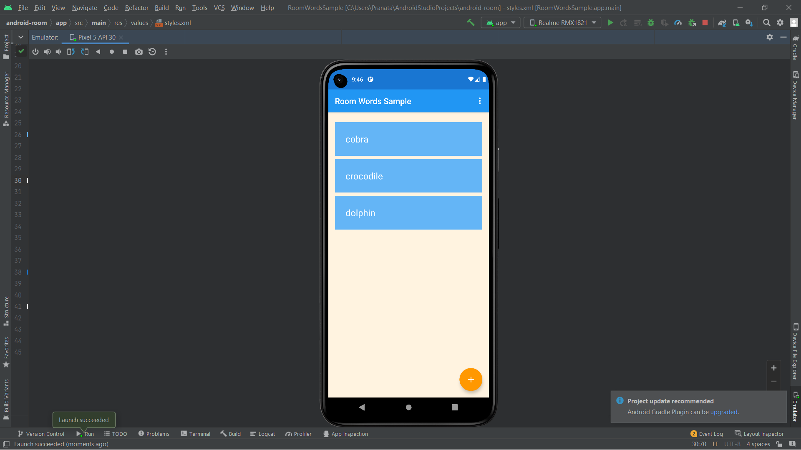
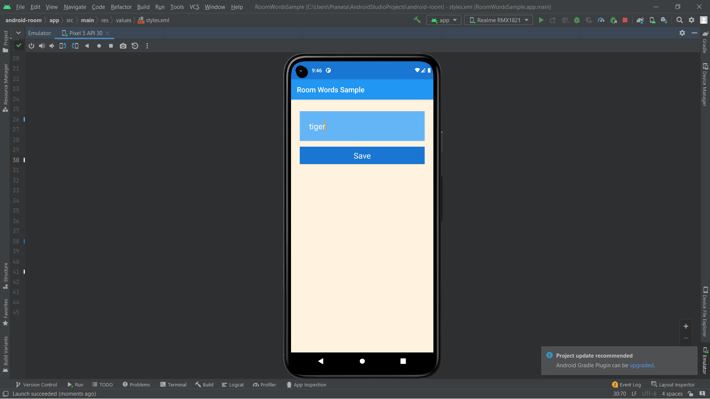
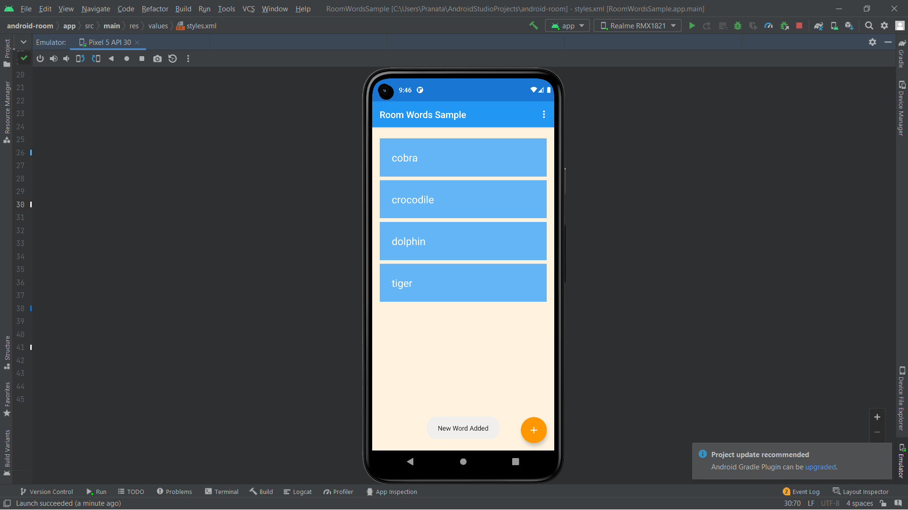
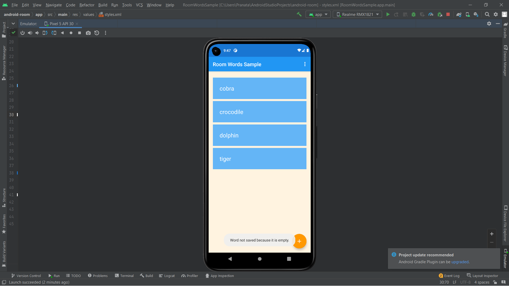
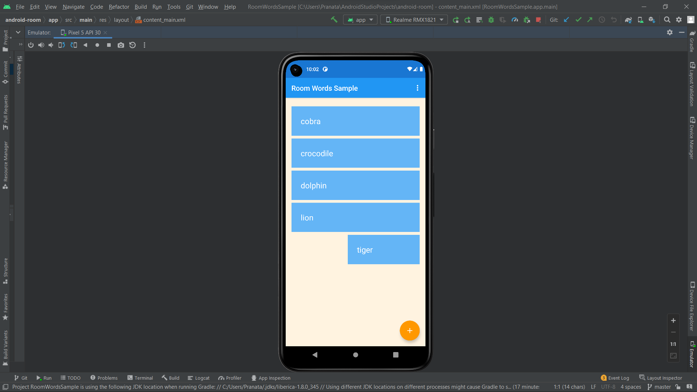
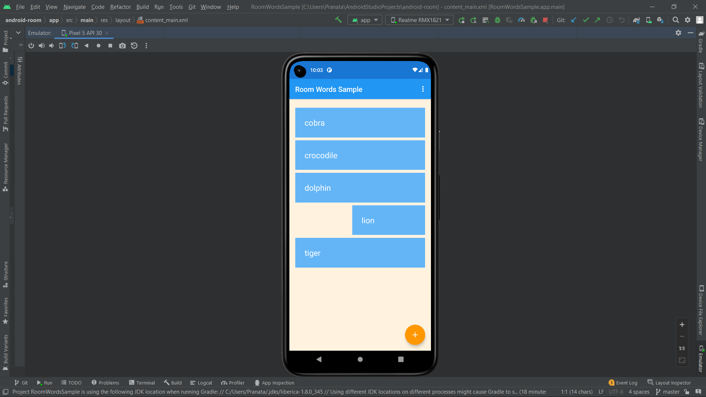
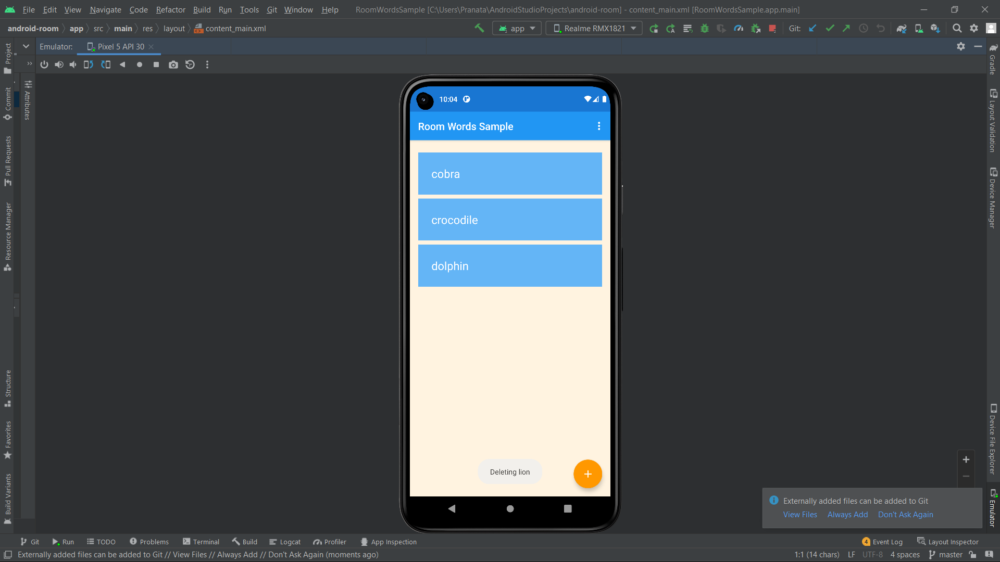
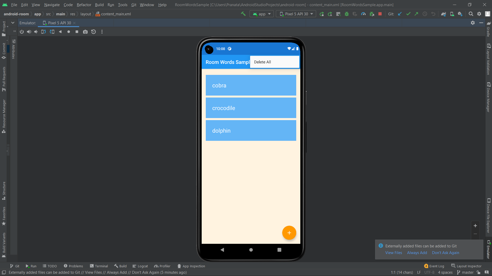
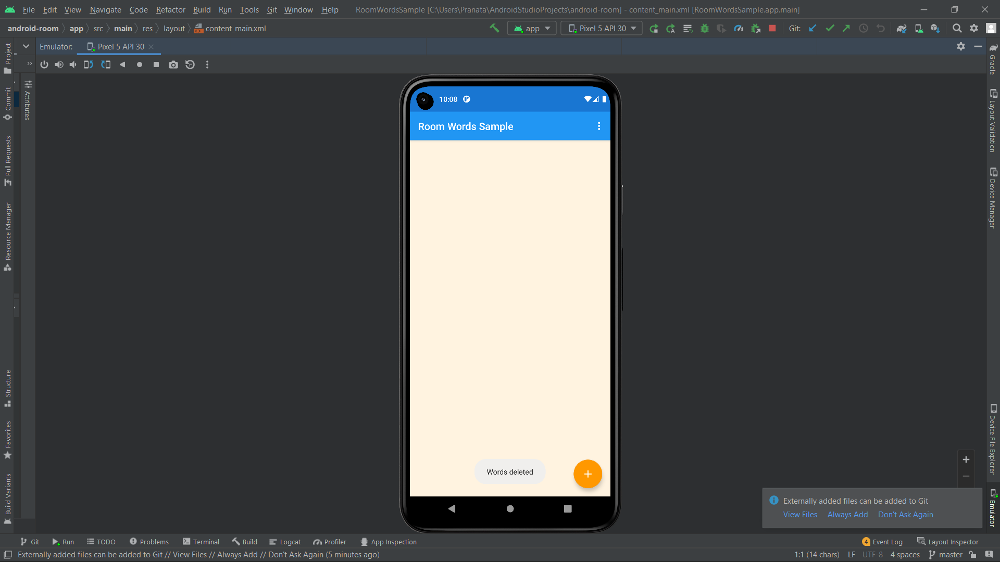

## Nama      : Pranata Dito Fitriyansyah
## Kelas     : TI - 3C
## No. Absen : 18

Tugas : Mengerjakan Android Room Database menggunakan android studio

Tampilan Awal

Tambah Data Baru

Berhasil Tambah Data

Gagal menambahkan data jika mengisi data dengan inputan kosong

Menghapus data dengan melakukan swipe kanan / kiri pada data

Berhasil menghapus data 

Menghapus semua data 

Berhasil menghapus semua data 

